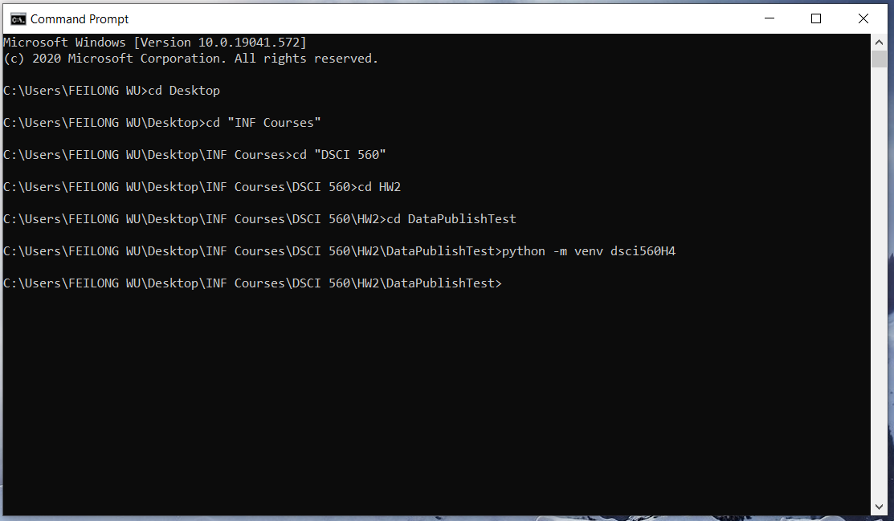
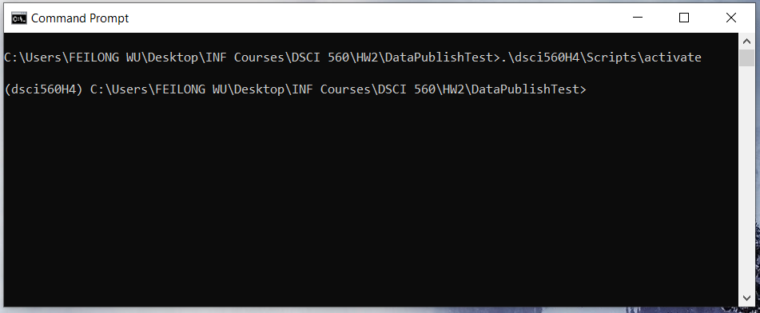
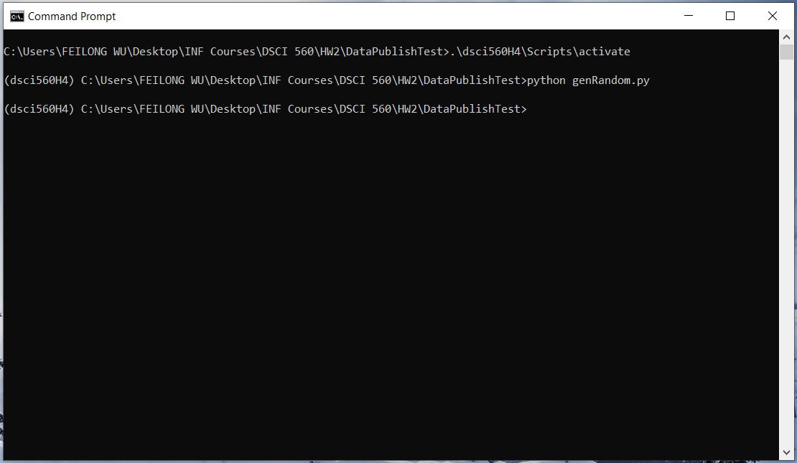
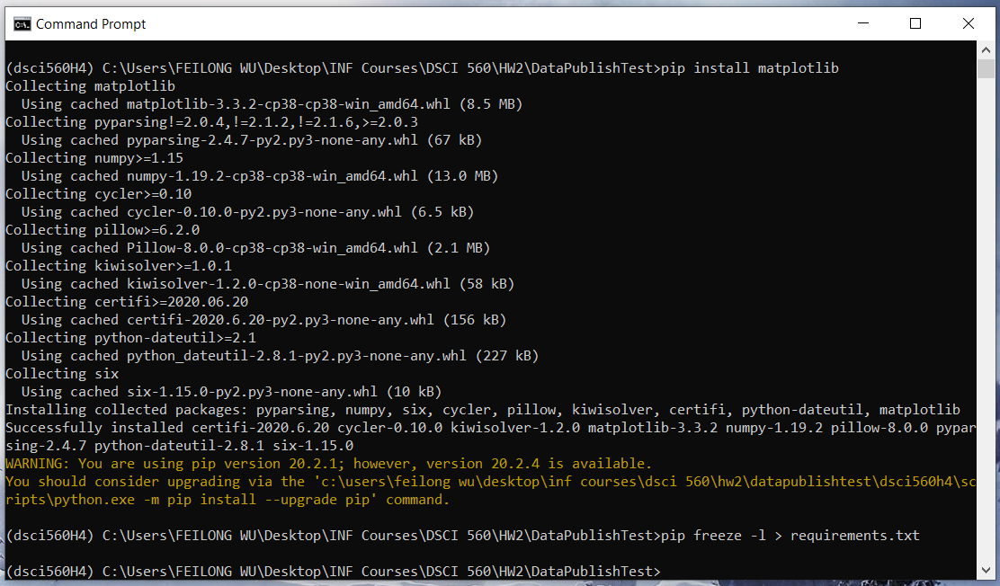
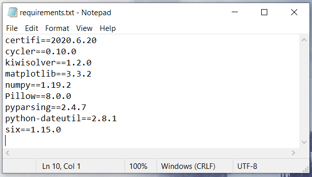

# DataPublishTest

[](https://zenodo.org/badge/latestdoi/295092084)

This repository contains three Python scripts, all of which should be executed in the following order. Use *genRandom.py* to generate pre-specified number of random intergers in a pre-specified range. The result will be outputted in a text file. A sample output file can be found here [here](https://dx.doi.org/10.6084/m9.figshare.12949601). Use *LinMap.py* to linearly transform a list of numbers as input with pre-specified slope and intercept. The output will be saved in a text file. An example output file can be found [here](https://dx.doi.org/10.6084/m9.figshare.12949619). Use *Vis.py* to visualize a list of numbers before and after linear transform in a scatter plot. The scatter plot will be saved as a file. A sample plot can be found [here](https://dx.doi.org/10.6084/m9.figshare.12956543). To learn more, check out this [Jupyter Notebook](https://github.com/FeilongWu/DataPublishTest/blob/master/demo.ipynb).

An example plot of the generated data is shown below.


## Homework Answers

### 1. In your local repository from homework 2, create a blank virtual environment and name it dsci560H4.
The virtual environment is created under the local repository.


### 2. Activate the environment and install ONLY the dependencies you need to execute the random number generator script of Homework 2.
The random number gererator uses Python standard libraries only, so no external dependency is required. Python3.8 is required to execute the random number generator. Other versions may work without a guarantee.

### 3. Take a screenshot of your terminal with the activated environment after running the script for the number generator.


### 4. Extract the dependencies of your virtual environment

#### a. Compare the packages that you manually installed versus the dependency list you extracted.
The only dependency installed manually is "matplotlib". There are dependencies besides "matplotlib" on the extracted list, which are the dependencies that "matplotlib" needs to use. First graph is dependency installation and the second graph is the extracted list.


#### c. Upload your extracted dependencies to GitHub following the naming conventions taught in class. 
The uploaded extracted list is named as "requirements.txt".


## Usage
- Clone this repo:
```bash
git clone https://github.com/FeilongWu/DataPublishTest.git
cd DataPublishTest
```
- Create a virtual environment (named dsci560H4) and activate it:
```bash
python -m venv dsci560H4
.\dsci560H4\Scripts\activate
```
- Install dependency(ies):
```bash
pip install -r requirements.txt
```
- Generate 1000 random numbers:
```bash
python genRandom.py
```
- Linearly transform the random numbers:
```bash
python LinMap.py
```
- Visualize random numbers and their linear transform:
```bash
python Vis.py
```
- Open notebook in binder:<br/>
Click this badget [](https://mybinder.org/v2/gh/FeilongWu/DataPublishTest/master) to open binder in a new tab. Jupyter notebook will be automatically launched when the environment is ready. See the progress in the log.

## Software Citation

Wu, Feilong (2020) DataPublishTest, GitHub. V.1.5 https://dx.doi.org/10.5281/zenodo.4049671

## Data Citation

### Cite random integers

Wu, Feilong (2020): data_x.txt. figshare. Dataset. https://doi.org/10.6084/m9.figshare.12949601.v2

### Cite numbers after linear transform

Wu, Feilong (2020): output. figshare. Dataset. https://doi.org/10.6084/m9.figshare.12949619.v2

### Cite scatter plot

Wu, Feilong (2020): Scatter Plot of the random integers and their linear transform. figshare. Figure. https://doi.org/10.6084/m9.figshare.12956543.v2
