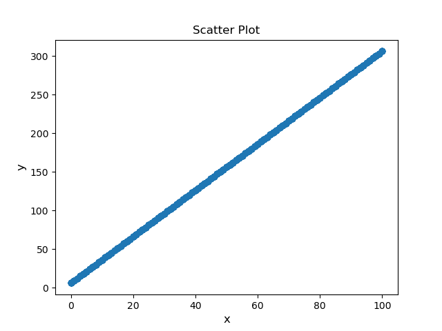

# DataPublishTest
[](https://zenodo.org/badge/latestdoi/295092084)

This repository contains three Python scripts. Use *genRandom.py* to generate user-specified number of random intergers in a user-specified range. Some sample numbers can be found here [here](https://dx.doi.org/10.6084/m9.figshare.12949601). Use *LinMap.py* to linearly transform a list of numbers as input with user-specified slope and intercept. Some example numbers can be found [here](https://dx.doi.org/10.6084/m9.figshare.12949619). Use *Vis.py* to visualize a list of numbers before and after some transform in a scatter plot. A sample plot can be found [here](https://dx.doi.org/10.6084/m9.figshare.12956543). To learn more, check out this [Jupyter Notebook](https://github.com/FeilongWu/DataPublishTest/blob/master/demo.ipynb).

An example plot of the generated data is shown below.



## Installation
- Clone this repo:
```bash
git clone https://github.com/FeilongWu/DataPublishTest.git
cd DataPublishTest
```

## Software Citation

Wu, Feilong (2020) DataPublishTest, GitHub. V.1.4 https://dx.doi.org/10.5281/zenodo.4048722

## Data Citation

### Cite random integers

Wu, Feilong (2020): data_x.txt. figshare. Dataset. https://doi.org/10.6084/m9.figshare.12949601.v2

### Cite numbers after linear transform

Wu, Feilong (2020): output. figshare. Dataset. https://doi.org/10.6084/m9.figshare.12949619.v2

### Cite scatter plot

Wu, Feilong (2020): Scatter Plot of the random integers and their linear transform. figshare. Figure. https://doi.org/10.6084/m9.figshare.12956543.v2
